<div align="center">



<a href="https://tanmaytrivedi.dev">
  
</a>

<br/>

[](https://tanmaytrivedi.dev)
[](mailto:tanmay.trivedi.jp@gmail.com)
[](https://www.linkedin.com/in/itanmaytrivedi)





</div>

## 🌙 &nbsp;ステータス · Status Window

<div align="center">

| 項目 | 詳細 |
| :--: | :-- |
| **名前** Name | Tanmay Trivedi · 田丸 環 |
| **職業** Class | Product Engineer — frontend-leaning full-stack |
| **ギルド** Guild | Founder of **Lynt** · Creator of **悠 Yuki AI** |
| **出身** Origin | Kanpur, India · B.Tech Biotechnology @ Rama University |
| **言語** Languages | English (business) · 日本語 (JLPT N1 — sitting July 2027) |
| **信条** Creed | 静かに作り、丁寧に届ける — *build quietly, deliver thoughtfully* |

</div>

## ✈️ &nbsp;旅路 · The Journey

<div align="center">

</div>

<div align="center">

| | Quest | Status |
| :--: | :-- | :--: |
| 🌸 | **Lynt** — Japan career & visa intelligence platform | [`LIVE ↗`](https://lynt.tanmaytrivedi.dev) |
| 🌙 | **悠 Yuki AI** — bilingual, honorific-aware Japan assistant | [`LIVE ↗`](https://yuki.tanmaytrivedi.dev) |
| 📖 | **JLPT N1** | `IN PROGRESS · JUL 2027` |
| ⛩️ | **Join a product-led team in Tokyo / Osaka** | `TARGET · 2029` |

</div>

<div align="center"></div>

## 🌸 &nbsp;制作物 · Selected Work

<div align="center">
<a href="https://tanmaytrivedi.dev">
  
</a>
<br/>
<sub>Full case studies → <a href="https://tanmaytrivedi.dev"><b>tanmaytrivedi.dev</b></a></sub>
</div>

<div align="center"></div>

## 🪐 &nbsp;技術の軌道 · Skill Orbit

<div align="center">

</div>

<details>
<summary><b>📋 &nbsp;Full stack, as a list</b></summary>

<br/>

| | |
| :-- | :-- |
| 🎨 **Frontend** | React · Next.js · Vite · TypeScript · Tailwind · shadcn/ui · Framer Motion |
| ⚙️ **Backend & Data** | Node.js · Go · PostgreSQL · Supabase (Auth, Realtime, Edge Functions) · Redis |
| 🧠 **AI** | Groq · Llama 3.3 70B · bilingual, honorific-aware prompt design |
| 🚀 **Ship** | Docker · AWS · Vercel · GitHub Actions |

</details>

<div align="center"></div>

## 🍡 &nbsp;オフ · Off-Duty

Slice-of-life and romance anime are my comfort genre, with *Jujutsu Kaisen*, *Bleach* and *Demon Slayer* for when I want something louder. I put Japanese culture into my products because I care about it, and that shows up in the details.

<details>
<summary><b>🌀 &nbsp;必殺技 · Special Move (click)</b></summary>

<br/>

> **全部実装 — Full-Stack Ship**
> One engineer, one feature, end to end: **design → Postgres → ship → measure → 日本語化**.
> Cooldown: none. Cost: a lot of tea.

</details>

<div align="center"></div>

## 💌 &nbsp;一緒に働きませんか · Let's Work Together

<div align="center">

I'm looking for **product-led Japanese teams** that value craft, bilingual delivery, and shipping over ceremony.

If you need one engineer who can own a feature end to end:

### **design → Postgres → ship → measure → 日本語化**

[](mailto:itanmaytrivedi@gmail.com)
[](https://tanmaytrivedi.dev)

</div>

<details>
<summary><b>⚙️ &nbsp;Under the hood — this site</b></summary>

<br/>

```text
src/
├─ assets/        static images, certificates, resumes
├─ components/    composable UI (Hero, Projects, LyntSection, …)
│  └─ ui/         shadcn primitives
├─ contexts/      LanguageContext (EN ↔ JP)
├─ data/          projectsData.ts — case-study source of truth
├─ hooks/         use-mobile, use-toast
├─ pages/         Index · ProjectDetail · NotFound
└─ index.css      design tokens, theme, semantic palette
```

```bash
bun install        # or: npm install
bun run dev        # vite at http://localhost:5173
bun run build
bun run preview
bunx vitest run
```

Built with React, Vite, TypeScript, Tailwind, shadcn/ui and Framer Motion. Deployed on Vercel, with a SPA rewrite in `vercel.json`. Bilingual EN ↔ JP through `LanguageContext`.

</details>

<div align="center">
<br/>

<br/>
<sub><i>「改善は毎日の小さな一歩から。」 Improvement is built one quiet commit at a time.</i></sub>
</div>
